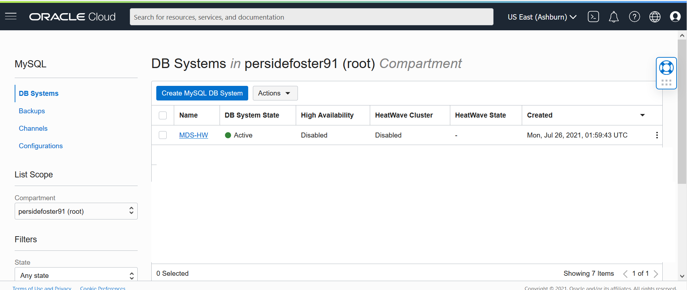
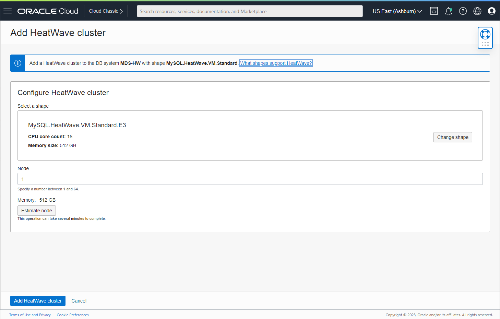
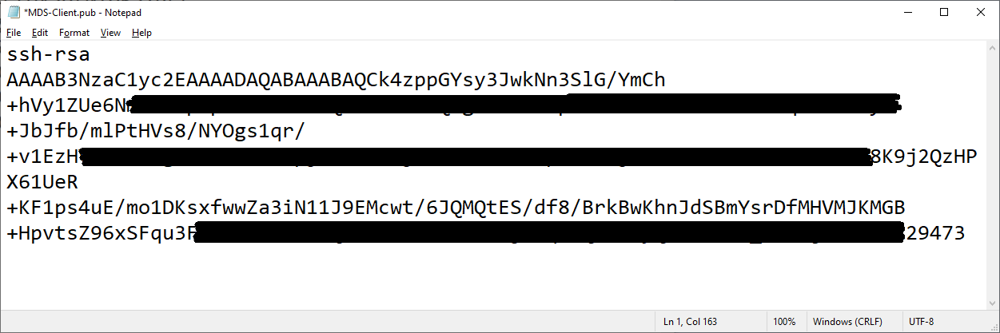
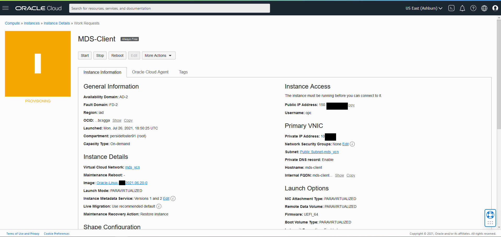
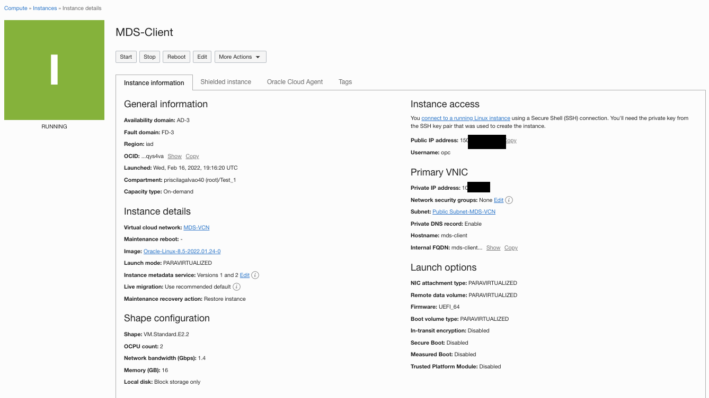
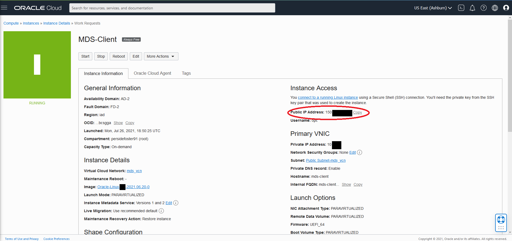
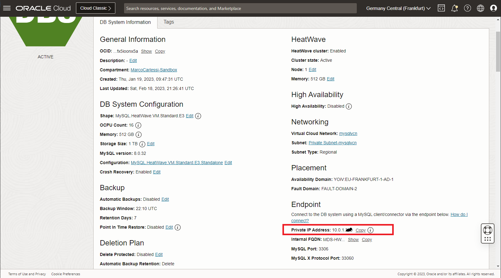
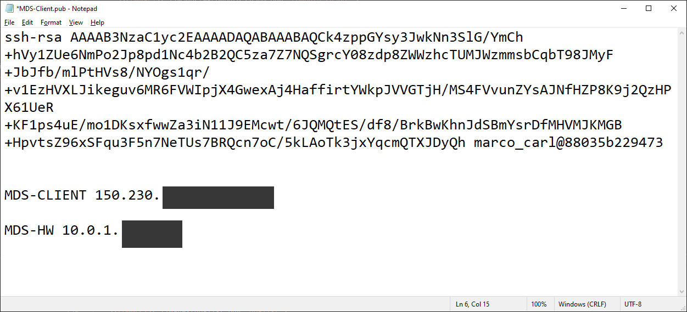
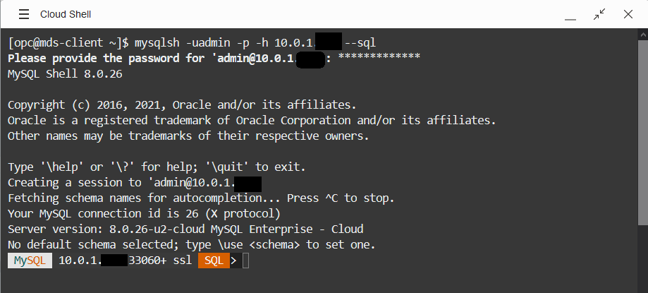

# Add HeatWave Cluster to MySQL Database Service and Connect

## Introduction

We have now a MySQL Database up and running. It's time now to add a HeatWave Cluster comprise of one or more HeatWave nodes to the system.

When working in the cloud, there are often times when your servers and services are not exposed to the public internet. The Oracle Cloud Infrastructure (OCI) MySQL cloud service is an example of a service that is only accessible through private networks. Since the service is fully managed, we keep it siloed away from the internet to help protect your data from potential attacks and vulnerabilities. It’s a good practice to limit resource exposure as much as possible, but at some point, you’ll likely want to connect to those resources. That’s where Compute Instance enters the picture. This Compute Instance can be used as application server or Bastion Host. A Bastion host is a resource that sits between the private resource and the endpoint which requires access to the private network and can act as a “jump box” to allow you to log in to the private resource through protocols like SSH.


Today, you will use the Compute Instance to connect from the browser to a MDS DB System

_Estimated Lab Time:_ 25 minutes

### Objectives

In this lab, you will be guided through the following tasks:

- Add a HeatWave Cluster to MySQL Database System
- Create SSH Key on OCI Cloud
- Create Compute Instance
- Setup Compute Instance with MySQL Shell
- Connect to MySQL DB System

### Prerequisites

- An Oracle Trial or Paid Cloud Account
- Some Experience with MySQL Shell
- Completed Lab 1

## Task 1: Add a HeatWave Cluster to MDS-HW MySQL Database System

1. Open the navigation menu
    Databases
    MySQL
    DB Systems

2. Choose the root Compartment. A list of DB Systems is displayed.

    

3. In the list of DB Systems, click the **MDS-HW** system.
click **More Action ->  Add HeatWave Cluster**.

    

4. On the “Add HeatWave Cluster” dialog, select “MySQL.HeatWave.VM.Standard.E3” shape

5. Click “Add HeatWave Cluster” to create the HeatWave cluster

    

6. HeatWave Clusters creation will take about 10 minutes. From the DB display page scroll down to the Resources section. Click the **HeatWave** link.<br>
   Your completed HeatWave Cluster Information section will look like this:

    

## Task 2: Create Compute instance

The Cloud Shell machine is a small virtual machine running a Bash shell which you access through the Oracle Cloud Console (Homepage). You will start the Cloud Shell and generate an SSH Key to use  for the Bastion Session.

1. To start the Oracle Cloud shell, go to your Cloud console and click the '**Developer tools**' icon at the top right of the page. This will open a menu. Click on '**Cloud Shell**'. This action open a new windows in the browser, please be patient that the first time it takes some time to generate it.

    

    

    **Note:** You can use the icons in the upper right corner of the Cloud Shell window to minimize, maximize, restart, and close your Cloud Shell session.*

2. Once the cloud shell has started, create the SSH Key using the following command:

    ```bash
    <copy>ssh-keygen -t rsa -f MDS-Client</copy>
    ```

    Press enter for each question.

    Here is what it should look like.

    

3. The public and private SSH keys are stored in the files MDS-Client and MDS-Client.pub. You can check them now

    ```bash
    <copy>ls -l</copy>
    ```

    

    There are two files in the output, a *private key:* `MDS-Client` and a *public key:* `MDS-Client.pub`. Keep the private key safe and don't share its content with anyone. The public key will be needed for various activities and can be uploaded to certain systems as well as copied and pasted to facilitate secure communications in the cloud.


4. Now you need a compute Instance to connect to your brand new MySQL database.
   But before creating the Compute instance, let's copy the public key to use it later.

   In the Cloud shell enter the following command to show the public key file content

    ```bash
    <copy>cat MDS-Client.pub</copy>
    ```

    

5. Copy the MDS-Client.pub content to the notepad

    Your notepad should look similar to this
    

6. To launch a Linux Compute instance, minimize the CLoud Shell and go to
    Navigation Menu
    Compute
    Instances
    

7. On Instances in **(root)** Compartment, click  **Create Instance**
    

8. On Create Compute Instance

    Enter Name

    ```bash
    <copy>MDS-Client</copy>
    ```

9. Make sure **(root)** compartment is selected

10. On Placement, keep the selected Availability Domain

11. On Image and Shape, '**keep the selected Image**', Oracle Linux 8

      

12. Select Instance Shape: VM.Standard.E4.Flex

      

13. On Networking, make sure '**MDS-VCN**' is selected

14. 'Assign a public IP' address should be set to Yes

    

15. On Add SSH keys, paste the public key from the notepad.

    

16. Click '**Create**' to finish creating your Compute Instance.

17. The New Virtual Machine will be ready to use after a few minutes. The state will be shown as 'Provisioning' during the creation

    

18. The state 'Running' indicates that the Virtual Machine is ready to use.

    

## Task 3: Connect to MySQL Database System

1. Copy the public IP address of the active Compute Instance to your notepad, to use it later

    - Go to Navigation Menu
            Compute
            Instances
    

    - Click the `MDS-Client` Compute Instance link

    

    - Copy `MDS-Client` plus  the `Public IP Address` to the notepad

2. Copy the private IP address of the active MySQL Database Service Instance to your notepad

    - Go to Navigation Menu
            Databases
            MySQL
     

    - Click the `MDS-HW` Database System link

     

    - Copy `MDS-HW` plus the `Private IP Address` to the notepad

3. Your notepad should look like the following:

     

4. Return to your Cloud Shell to connect to your instance, using the private key that you created earlier with **MDS-Client**.

    Enter the username **opc** and your Public **IP Address**.

    Note: The **MDS-Client**  shows the  Public IP Address as mentioned on TASK 5: #11

    (Example: **ssh -i MDS-Client opc@132.145.170...**)

    ```bash
    <copy>ssh -i MDS-Client opc@<your_compute_instance_ip></copy>
    ```

   

    **Install MySQL Shell on the Compute Instance**

5. You will need a MySQL client tool to connect to your new MySQL DB System from your client machine.

    Install MySQL Shell with the following command

    **[opc@…]$**

    ```bash
    <copy>sudo yum install mysql-shell -y</copy>
    ```

    

   **Connect to MySQL Database Service**

6. From your Compute instance, connect to MDS-HW MySQL using the MySQL Shell client tool.

   The endpoint (IP Address) can be found in your notepad or the MDS-HW MySQL DB System Details page, under the "Endpoint" "Private IP Address".

    

7. Use the following command to connect to MySQL using the MySQL Shell client tool. Be sure to add the MDS-HW private IP address at the end of the command. Also, enter the admin user and the database password created on Lab 1

    (Example  **mysqlsh -uadmin -p -h10.0.1..   --sql**)

    **[opc@...]$**

    ```bash
    <copy>mysqlsh -uadmin -p -h 10.0.1.... --sql</copy>
    ```

    

You may now proceed to the next lab.

## Learn More

- [Cloud Shell](https://www.oracle.com/devops/cloud-shell/?source=:so:ch:or:awr::::Sc)
- [Virtual Cloud Network](https://docs.oracle.com/en-us/iaas/Content/Network/Concepts/overview.htm)
- [OCI Bastion Service] (https://docs.public.oneportal.content.oci.oraclecloud.com/en-us/iaas/Content/Bastion/Tasks/connectingtosessions.html)

## Acknowledgements

- **Author** - Perside Foster, MySQL Solution Engineering
- **Contributor** - Frédéric Descamps, MySQL Community Manager, Marco Carlessi, MySQL Solution Engineering
- **Last Updated By/Date** - Perside Foster, July  2022
