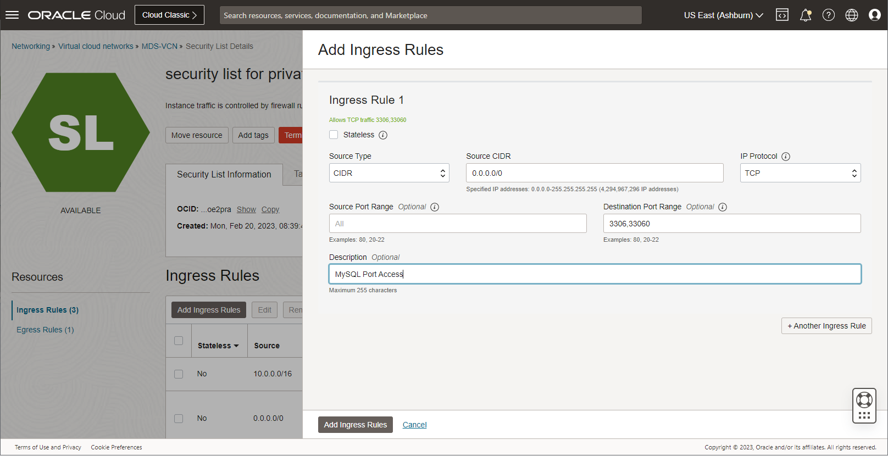
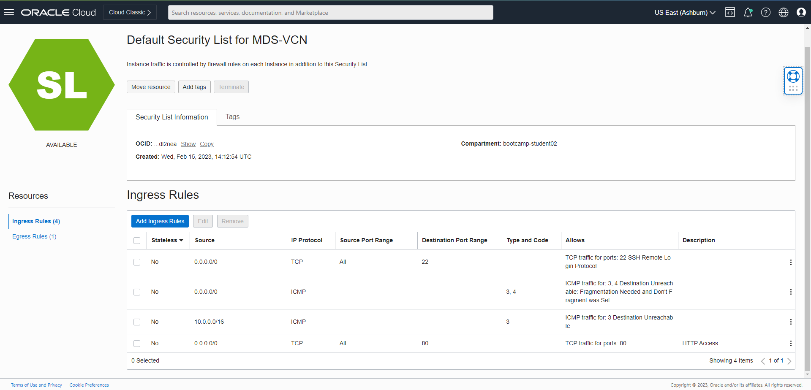
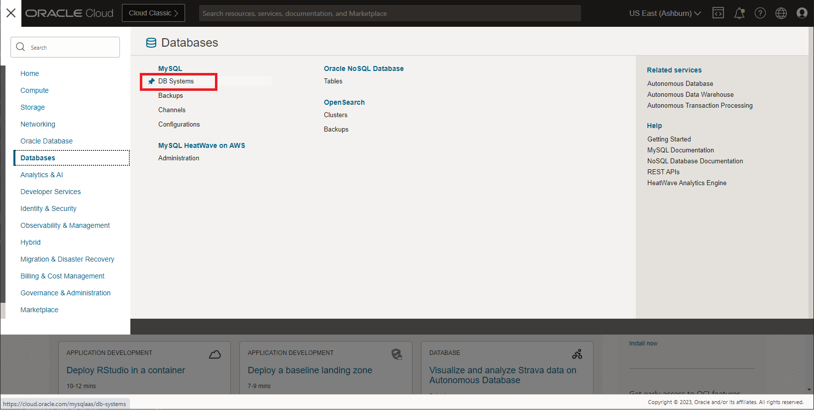

# Create MySQL Database HeatWave  and Cluster

## Introduction

In this lab, you will create and configure a Virtual Cloud Network and a MySQL HeatWave Database System. Once the HeatWave Database is fully created,  you will add a HeatWave Cluster comprise of two or more HeatWave nodes to the system.

_Estimated Time:_ 20 minutes

### Objectives

In this lab, you will be guided through the following tasks:

- Create a Virtual Cloud Network
- Create MySQL HeatWave Database
- Add a HeatWave Cluster to MySQL Database System

### Prerequisites

- An Oracle Trial or Paid Cloud Account
- Some Experience with MySQL Shell

## Task 1: Create a Virtual Cloud Network

1. Click **Navigation Menu**, **Networking**, then **Virtual Cloud Networks**
    
2. Click **Start VCN Wizard**
    

3. Select 'Create VCN with Internet Connectivity'

    Click 'Start VCN Wizard'
    

4. Create a VCN with Internet Connectivity

    On Basic Information, complete the following fields:

    VCN Name:

    ```bash
    <copy>MDS-VCN</copy>
    ```

    Compartment: Select  **(root)**

    Your screen should look similar to the following

    

5. Click 'Next' at the bottom of the screen

6. Review Oracle Virtual Cloud Network (VCN), Subnets, and Gateways

    Click 'Create' to create the VCN
    

7. The Virtual Cloud Network creation is completing
    

8. Click 'View Virtual Cloud Network' to display the created VCN
    

9. On MDS-VCN page under 'Subnets in (root) Compartment', click  '**Private Subnet-MDS-VCN**'
     

10. On Private Subnet-MDS-VCN page under 'Security Lists',  click  '**Security List for Private Subnet-MDS-VCN**'
    

11. On Security List for Private Subnet-MDS-VCN page under 'Ingress Rules', click '**Add Ingress Rules**'
    

12. On Add Ingress Rules page under Ingress Rule 1

    Add an Ingress Rule with Source CIDR

    ```bash
    <copy>0.0.0.0/0</copy>
    ```

    Destination Port Range

    ```bash
    <copy>3306,33060</copy>
    ```

    Description

    ```bash
    <copy>MySQL Port Access</copy>
    ```

    Click 'Add Ingress Rule'
        

13. On Security List for Private Subnet-MDS-VCN page, the new Ingress Rules will be shown under the Ingress Rules List
    

14. Because last lab requires web access, we open now the port 80/HTTP.
Click **Navigation Menu**, **Networking**, then **Virtual Cloud Networks**
    

15. Click the VCN name '**MDS-VCN**' to show the subnets
    

16. Click the subnet '**Public Subnet-MDS-VCN**' to show the associated security lists
    

17. On Public Subnet-MDS-VCN page under 'Security Lists', click '**Default Security List for MDS-VCN**'
    

17. On Public Subnet-MDS-VCN page under 'Security Lists', click '**Default Security List for MDS-VCN**'
    

18. On Security List for Public Subnet-MDS-VCN page under 'Ingress Rules', click '**Add Ingress Rules**'
    

19. On Add Ingress Rules page under Ingress Rule 1

    Add an Ingress Rule with Source CIDR

    ```bash
    <copy>0.0.0.0/0</copy>
    ```

    Destination Port Range

    ```bash
    <copy>80</copy>
    ```

    Description

    ```bash
    <copy>HTTP Access</copy>
    ```

    Click 'Add Ingress Rule'
        

20. On Security List for Public Subnet-MDS-VCN page, the new Ingress Rules will be shown under the Ingress Rules List
    

## Task 2: Create a MySQL Database for HeatWave (DB System) 

1. Go to Navigation Menu
         Databases
         MySQL
         DB Systems
    

2. Click 'Create MySQL DB System'

    

3. Create MySQL DB System dialog and complete the fields in each section

    - Provide basic information for the DB System
    - Setup your required DB System
    - Create Administrator credentials
    - Configure Networking
    - Configure placement
    - Configure hardware
    - Exclude Backups
    - Advanced Options - Set  Host Name

4. Provide basic information for the DB System:

    Select Compartment **(root)**

    Enter Name

    ```bash
    <copy>MDS-HW</copy>
    ```

    Enter Description

    ```bash
    <copy>MySQL Database Service HeatWave instance</copy>
    ```

    Select **HeatWave** to specify a HeatWave DB System

    

5. Create Administrator Credentials (write username and password to notepad for later use)

    **Enter Username** : admin 

    **Enter Password** : 

    **Confirm Password** (value should match the password for later use)

    

6. On Configure networking, keep the default values

    Virtual Cloud Network: **MDS-VCN**

    Subnet: **Private Subnet-MDS-VCN (Regional)**

    

7. On Configure hardware, keep default shape as **MySQL.HeatWave.VM.Standard.E3**

    Data Storage Size (GB) Set value to:  **512**

    ```bash
    <copy>512</copy>
    ```

    

8. On Configure Backups, disable 'Enable Automatic Backup'

    

9. Go to the Networking tab, in the Hostname field enter (same as DB System Name):

    ```bash
    <copy>MDS-HW</copy>
    ```

10. Click the '**Create**' button

    

    

11. The New MySQL DB System will be ready to use after a few minutes

    The state will be shown as 'Creating' during the creation

    

12. The state 'Active' indicates that the DB System is ready for use

    On MDS-HW Page, check the MySQL Endpoint (Private IP Address)

    

## Acknowledgements

- **Author** - Perside Foster, MySQL Solution Engineering
- **Contributors** - Mandy Pang, MySQL Principal Product Manager,  Priscila Galvao, MySQL Solution Engineering, Nick Mader, MySQL Global Channel Enablement & Strategy Manager, Frédéric Descamps, MySQL Community Manager
- **Last Updated By/Date** - Perside Foster, MySQL Solution Engineering, July 2022
